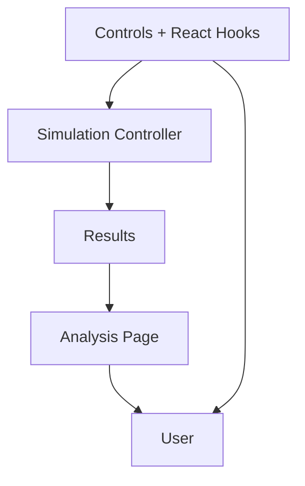

# EV Charging Simulation Project
-----

## Task 1: Simulating EV Charger Usage

We’re simulating 20 EV charge points with 11kW power each, running in 15-minute intervals over a year (365 days). The goal is to answer:

- How much energy is consumed (in kWh)?
- What is the theoretical maximum power demand?
- What is the actual maximum power demand?
- What’s the concurrency factor (actual max power / theoretical max power)?

### Assumptions
- Intervals are minutes, and probability data in hour range. Assuming poission distribution, probability of car arrival for interval can be p / 4, where p is probability of car arrival in that hour. 
- No queue. If two car arrives at one charge point, there is no queue. I am assuming the car left :(
- probability car arrival is for per-charge point, not the parking lot. Otherwise, I would need number of cars entered into lot to compute.
- Ignoring the impact of DST. in my mind, its not significant considering probabilities, but can be due to repeat/drop of hour. 

### Process
- random.random() is used to simulate interval whether a car arrived and if so, whats the demand.
- probabilities for distance are converted to cumulatitive and random(), estimates the cumulative probabilty.
- for each run of simulation, answers can be different. Tried seeding and not seeding, i think not seeding gives a closer range.

### Solutions
- Energy consumed = ~55951.5 kwH,
- Max Theoritical Power = 220 kw,
- Max Actual Power = ~77 kw,
- Concurrency = ~0.35

### Bonuses:

Concurrency vs Number of Charge Points: I think its exponential decay

Random vs Seed: As expected, seed is more deterministic with 0 std.

## Task 2: UI Design

### UI/UX Design
ended up using two panel approach -> Request <> Response Pair. Where left panel shows all controls and right area shows the plots using bento-box approach.

### Developing Philosophy

ATOMS + MOLECULES + COMPONENTS/ORGANISMS

Atoms: Wrapper for HTML owned components like <button> with my own styling, interface and behavior.  Eg. NumberSlider, Buttons, etc. These examples are also optimized for re-renders using memoization (only for more likely static components).
Molecules: Although not required for this project, used to construct table-inputs. Its more complex using atoms, but still valuable enough for reusability.
Organisms: Full components visible to users. Like SidePanel, results.

Note: I also like to use strong-types for physics units for better readability and type control. For eg, Power_KwH (can be trim to kwH)

### Architecture:

### Technology
tailwind + brand-styles, React, Plotly, and typescript.

### Bonus:
1. UI for multiple type of charging points: Opted for table inputs with tab-switch between simple and advance. Table-input comes with dyanmic rows with + and - features.

2. Yes, i did connect UI with the quick version of task-1 in JS.

## Task 2: API Endpoints 

### Technology
Express with local storage (temp dir of os), and json as datatype.

### API Endpoints
1. CREATE, UPDATE, READ and DELETE , based on unique id (UUID) for inputs. Its saved right when user clicks on Submit.
2. I use this table to populate the initial values, to persist the user settings.
3. Output/Results uses same UUID to store in output table. useful for queries later and merging tables.
4. Simulation end-point only mocks.

Example Input: 

`[{"inputId":"b52d6138-1184-49ee-ba2e-273380bf438c","uniform_NumChargePoints":20,"uniform_ChargePointPower":11,"carPowerRating":18,"carArrivalProbabilityMultiplier":100},{"inputId":"f57574c0-ed1c-42b2-b299-76d5b02dc618","uniform_NumChargePoints":20,"uniform_ChargePointPower":11,"carPowerRating":18,"carArrivalProbabilityMultiplier":100},{"inputId":"e12ccbba-0d06-46e5-9929-a14d17461eef","uniform_NumChargePoints":20,"uniform_ChargePointPower":11,"carPowerRating":18,"carArrivalProbabilityMultiplier":100},`

### Future;
1. Moving simulation here instead of UI layer
2. Typescript + transpilign to make it type-safe.

### How to run this ? 

Run the shell script which starts both server
`chmod +x start.sh && ./start.sh`

